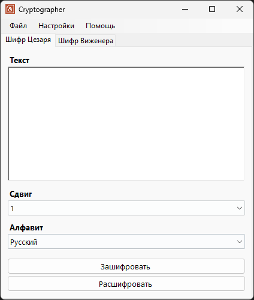
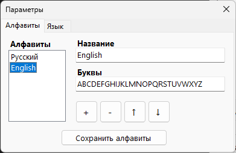

# Cryptographer 🔐

Приложение для шифрования и дешифрования текста с использованием классических шифров Цезаря и Виженера. Разработано на C# WinForms с поддержкой кастомных алфавитов и локализации.



## 🎯 Основные возможности

### 🔧 Шифры
- **Шифр Цезаря** - простой подстановочный шифр со сдвигом
- **Шифр Виженера** - полиалфавитный шифр с использованием ключа

### 🌍 Многоязычный интерфейс
- Английский и русский языки
- Автоматическое определение языка системы
- Возможность ручного переключения

### 📝 Кастомные алфавиты
- Создание собственных алфавитов
- Управление порядком алфавитов
- Сохранение алфавитов в XML-файл



### 💾 Работа с файлами
- Загрузка текста из файлов (.txt)
- Сохранение результата в файлы
- Сохранение настроек между сессиями

## 🚀 Запуск проекта

### Требования
- .NET Framework 4.7.2
- Visual Studio 2019/2022

### Инструкция по сборке
1. Клонируйте репозиторий
2. Откройте решение в Visual Studio
3. Соберите решение (Ctrl+Shift+B)
4. Запустите проект (F5)

## 🎮 Использование

### Шифр Цезаря
1. Выберите вкладку "Caesar"
2. Выберите алфавит из выпадающего списка
3. Укажите величину сдвига
4. Введите текст для шифрования
5. Нажмите "Encrypt" для шифрования или "Decrypt" для дешифрования

### Шифр Виженера
1. Выберите вкладку "Vigenere"
2. Выберите алфавит
3. Введите ключ шифрования
4. Введите текст для шифрования
5. Нажмите "Encrypt" для шифрования или "Decrypt" для дешифрования


### Примеры использования
```
Текст: HELLO WORLD
Ключ (Виженер): KEY
Алфавит: English
Сдвиг (Цезарь): 3

Результат Цезаря: KHOOR ZRUOG
Результат Виженера: RIJVS UYVJN
```

## ⚙️ Настройки

### Управление алфавитами
1. **Параметры** → **Алфавиты**
2. Добавьте новый алфавит:
   - Введите название
   - Укажите символы (например: "ABCDEFGHIJKLMNOPQRSTUVWXYZ")
3. Упорядочите алфавиты с помощью кнопок вверх/вниз
4. Сохраните изменения

### Предустановленные алфавиты
- **English**: A-Z (26 символов)
- **Русский**: А-Я + Ё (33 символа)

## 🏗️ Архитектура проекта

### Основные компоненты
```
Cryptographer/
├── CipherLib/                   # Библиотека шифров
│   ├── Alphabet.cs              # Класс алфавита
│   ├── CaesarCipher.cs          # Реализация шифра Цезаря
│   ├── VigenereCipher.cs        # Реализация шифра Виженера
│   └── Exceptions/              # Пользовательские исключения
├── Forms/
│   ├── FormStart.cs             # Главное окно
│   ├── FormSettings.cs          # Окно настроек
│   └── FormHelp.cs              # Окно справки
├── Properties/
│   ├── Settings.settings        # Настройки приложения
│   └── MyStrings.resx           # Локализованные строки
└── Resources/                   # Графические ресурсы
```

### Классы шифров
- **`CaesarCipher.EnDecrypt()`** - шифрование/дешифрование методом Цезаря
- **`VigenereCipher.EnDecrypt()`** - шифрование/дешифрование методом Виженера
- **`Alphabet`** - представление пользовательского алфавита

## 👨‍💻 Автор

Проект был разработан в рамках обучения программированию на C#. Демонстрирует применение классических криптографических алгоритмов, работу с файлами, сериализацией данных и создание многоязычных приложений.
